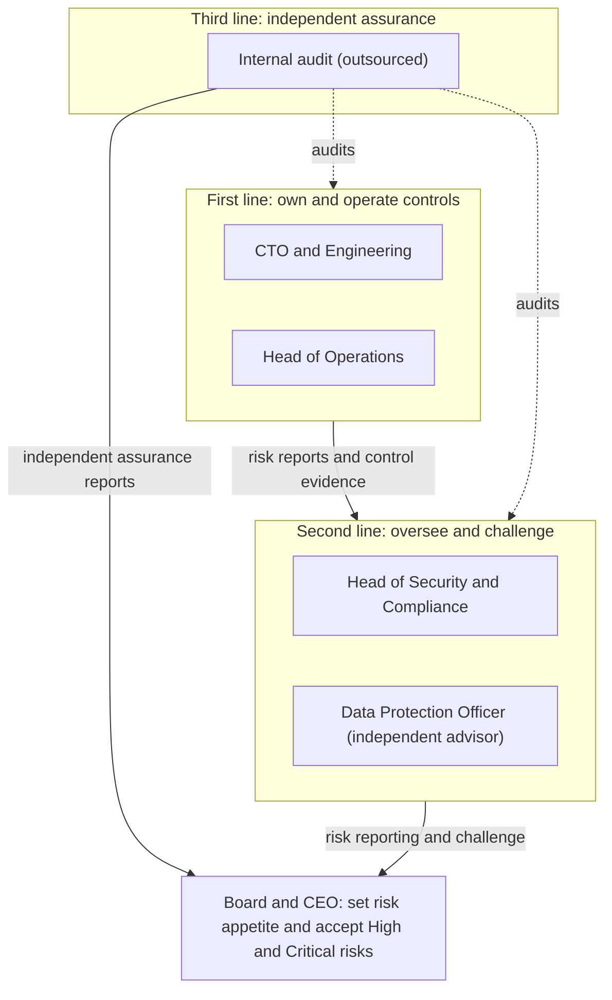

# Three Lines of Defense: Northbridge Health Ltd

```mermaid
flowchart TB
  Board["Board and CEO: set risk appetite and accept High and Critical risks"]
  subgraph L1["First line: own and operate controls"]
    CTO["CTO and Engineering"]
    OPS["Head of Operations"]
  end
  subgraph L2["Second line: oversee and challenge"]
    GRC["Head of Security and Compliance"]
    DPO["Data Protection Officer (independent advisor)"]
  end
  subgraph L3["Third line: independent assurance"]
    IA["Internal audit (outsourced)"]
  end
  L1 -->|risk reports and control evidence| L2
  L2 -->|risk reporting and challenge| Board
  IA -->|independent assurance reports| Board
  IA -.->|audits| L1
  IA -.->|audits| L2
```